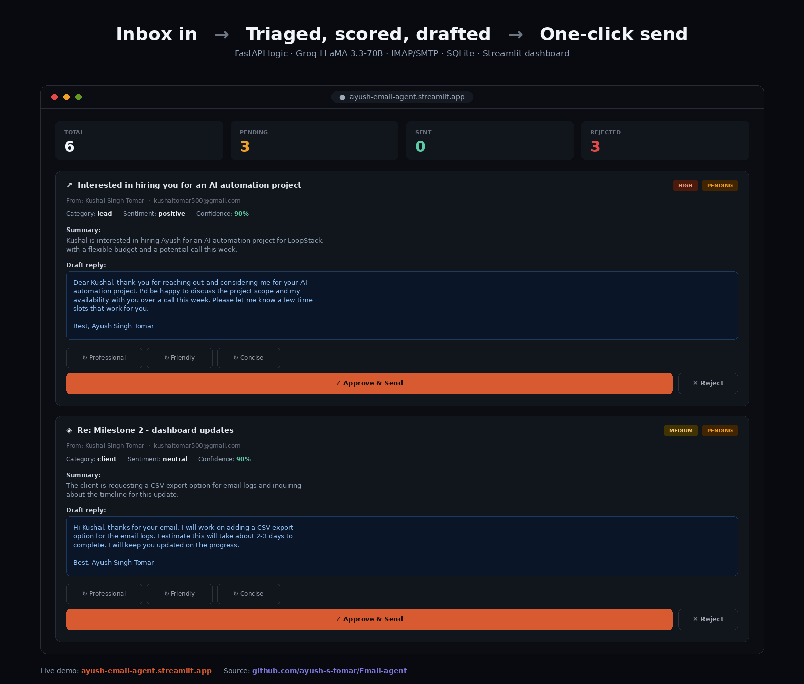

# 📧 AI Email Automation Agent

[](https://ayush-email-agent.streamlit.app)
[](https://github.com/ayush-s-tomar/Email-agent/actions)
[](LICENSE)
[](https://www.python.org/)
[](https://streamlit.io)
[](https://console.groq.com)

An AI agent that reads your Gmail inbox, classifies each email, drafts a reply with LLaMA 3.3, and lets you review and approve everything from a live dashboard — no Google Cloud project, no OAuth screen, just a Gmail App Password and a free Groq API key.

**🔗 Live demo:** [ayush-email-agent.streamlit.app](https://ayush-email-agent.streamlit.app)
**📦 Source:** this repo

---

## 🎬 Demo



**Watch it triage a live inbox in ~10 seconds:**

https://github.com/user-attachments/assets/e327872b-8b59-46e0-8ff2-13e2a40bf935

*(If the video doesn't render inline, [download it directly](docs/email_agent_full_captioned.mp4) or try the [live app](https://ayush-email-agent.streamlit.app) yourself.)*

---

## 🚀 What it does

- Reads unread emails from Gmail via IMAP
- Analyzes each one with Groq (LLaMA 3.3 70B) — category, priority, sentiment, summary, key info
- Drafts a professional reply, signed with your name
- Lets you rewrite the draft's tone (Professional / Friendly / Concise) with one click
- Approve & send, or reject, directly from the dashboard
- Groups related emails into threads
- Tracks cycle health — total runs, error counts, last successful sync
- Built-in analytics tab — category, sentiment, and status breakdowns
- Composes personalized cold outreach emails on demand
- Persists everything to SQLite, so nothing is lost on restart

## 🛠️ Tech stack

| Layer | Technology |
|---|---|
| AI / LLM | Groq API — LLaMA 3.3 70B (free tier) |
| App | Python, Streamlit |
| Email | IMAP (read) + SMTP (send) — no Google Cloud needed |
| Storage | SQLite (WAL mode) |
| Logging | Rotating log files + in-app cycle health strip |

## 📁 Project structure

```
Email-agent/
├── streamlit_app.py          # The entire UI — inbox, analytics, compose
├── backend/
│   ├── agent.py                # Core logic — IMAP fetch, Groq analysis, SQLite, SMTP send
│   ├── .env.example
│   └── requirements.txt
├── .streamlit/
│   └── secrets.toml.example   # Template for Streamlit Cloud secrets
├── .github/workflows/
│   └── ci.yml                 # Lint + syntax check on every push
├── requirements.txt            # Root deps for Streamlit Cloud
└── docs/
    ├── screenshot.png
    └── email_agent_full_captioned.mp4
```

## ⚡ Quick start (local)

**1. Clone the repo**
```bash
git clone https://github.com/ayush-s-tomar/Email-agent.git
cd Email-agent
```

**2. Get your free API keys**

- **Groq API** (free, no credit card) — [console.groq.com](https://console.groq.com) → API Keys → Create key
- **Gmail App Password** (2 min) — [myaccount.google.com/security](https://myaccount.google.com/security) → enable 2-Step Verification → search "App Passwords" → create one named `email-agent` → copy the 16-character password

**3. Configure environment**
```bash
cd backend
cp .env.example .env   # Windows: copy .env.example .env
```
Fill in `.env`:
```env
GROQ_API_KEY=gsk_xxxxxxxxxxxxxxxxxxxx
GMAIL_ADDRESS=you@gmail.com
GMAIL_APP_PASS=abcd efgh ijkl mnop
YOUR_NAME=Your Full Name
YOUR_ROLE=Freelance AI Developer
```

**4. Install dependencies and run**
```bash
cd ..
pip install -r requirements.txt
streamlit run streamlit_app.py
```

**5. Open the dashboard**

Streamlit opens automatically at `http://localhost:8501`. Click **Run Now**.

## ☁️ Deploy your own (Streamlit Community Cloud, free)

1. Fork this repo
2. Go to [share.streamlit.io](https://share.streamlit.io) → **New app**
3. Repository: your fork · Branch: `main` · Main file path: `streamlit_app.py`
4. Under **Advanced settings → Secrets**, paste:
   ```toml
   GROQ_API_KEY = "gsk_..."
   GMAIL_ADDRESS = "you@gmail.com"
   GMAIL_APP_PASS = "abcd efgh ijkl mnop"
   YOUR_NAME = "Your Full Name"
   YOUR_ROLE = "Freelance AI Developer"
   ```
5. Deploy

No server to keep alive, no monthly sleep limits like Render's free tier — Streamlit Cloud only sleeps after ~7 days of no visitors.

## 🎯 How it works

```
Gmail inbox (IMAP)
      ↓
  Fetch unread emails
      ↓
  Groq API (LLaMA 3.3 70B)
  → category, priority, sentiment, summary, draft reply
      ↓
  Store in SQLite + session state
      ↓
  Streamlit dashboard
  → Review · Edit tone · Approve & Send / Reject
      ↓
  Gmail SMTP → reply sent
```

## 📊 Email categories

| Category | Description |
|---|---|
| 📈 Lead | Potential job/business opportunity |
| 🤝 Client | Existing client communication |
| 🛠️ Support | Help or technical requests |
| 📰 Newsletter | Newsletters and subscriptions |
| 🚫 Spam | Spam or unwanted email |
| 📬 Other | Everything else |

## 🔒 Security notes

- `.env` and `.streamlit/secrets.toml` are never committed to Git (see `.gitignore`)
- The Gmail App Password only grants email access — it cannot log into your full Google account
- All data stays local/session-scoped — nothing leaves your environment except the email content sent to Groq for analysis

## 🧪 CI/CD

Every push to `main` runs a GitHub Actions workflow (`.github/workflows/ci.yml`) that:
- Installs dependencies
- Byte-compiles all Python files to catch syntax errors
- Runs `flake8` for basic linting

See the [Actions tab](https://github.com/ayush-s-tomar/Email-agent/actions) for build status.

## 🧠 Interview talking points

**"What does this project do?"**
It's an AI agent that automates email triage. It connects to Gmail via IMAP, sends each unread email to LLaMA 3.3 through Groq's API for analysis, gets back structured JSON with category/priority/summary/draft reply, and surfaces everything in a Streamlit dashboard where I can approve replies with one click.

**"Why Groq instead of OpenAI?"**
Groq has a completely free tier with no credit card required, and their inference speed is significantly faster — ideal for batch-processing emails. LLaMA 3.3 70B is more than sufficient for structured classification tasks.

**"Why IMAP instead of the Gmail API?"**
IMAP works with just a Gmail App Password — no Google Cloud project, no OAuth consent screen, no `credentials.json`. Simpler to set up and easier for anyone to replicate from the README.

**"Why Streamlit instead of FastAPI + React?"**
The original build used FastAPI + React + Render, but Render's free tier sleeps monthly, which broke the live demo. Migrating to a single-file Streamlit app removed the separate backend/frontend split entirely, deploys for free with no sleep limit, and still exposes the same triage/approve/analytics/compose functionality.

**"What is the cold email composer?"**
A built-in feature where you enter a recipient's name, company, and target role — LLaMA 3.3 generates a personalized ~80-word cold email instantly. It's the tool I use for my own recruiter and client outreach.

## 📌 Roadmap

- [x] Deploy to Streamlit Community Cloud
- [x] Cold email composer with LLaMA 3.3
- [x] Persistent storage with SQLite
- [x] Email threading (reply-to-reply)
- [x] Tone rewriting (Professional / Friendly / Concise)
- [x] Cycle health tracking + rotating logs
- [ ] Slack/WhatsApp notification on high-priority emails
- [ ] Multi-account support in the Streamlit UI

## 📄 License

MIT — see [LICENSE](LICENSE).

## 👤 Author

**Ayush Singh Tomar**
GitHub: [@ayush-s-tomar](https://github.com/ayush-s-tomar)
LinkedIn: [linkedin.com/in/ayush-singh-tomar-4151b0282](https://linkedin.com/in/ayush-singh-tomar-4151b0282)

Built as part of my AI developer portfolio — this is the exact tool I use for managing recruiter and client outreach.
