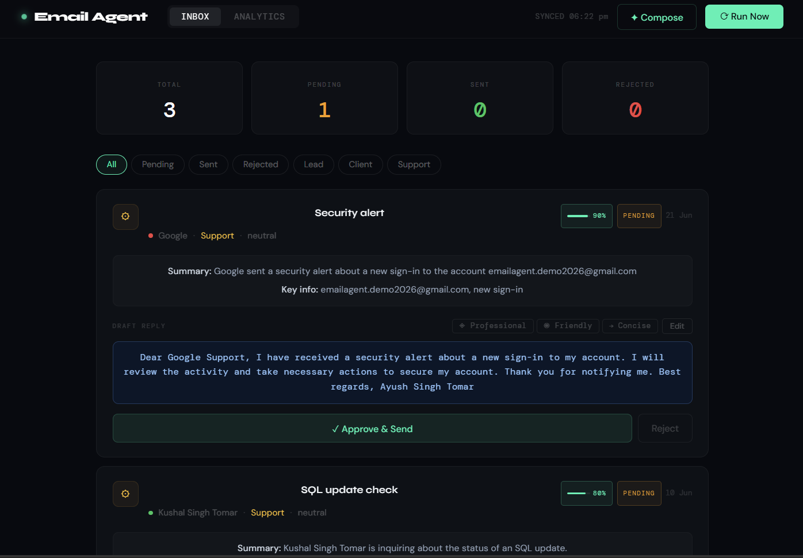

# Email Agent

AI-powered email triage system that reads your Gmail inbox, classifies and prioritizes messages with LLaMA 3.3, drafts professional replies, and lets you approve or reject each one from a live dashboard — no Google Cloud project required.

**Live demo:** [email-agent-xi-drab.vercel.app](https://email-agent-xi-drab.vercel.app)



---

## Why this exists

Manually triaging an inbox — figuring out what's urgent, what's a lead, what's spam, and drafting a reply for each — is repetitive work that an LLM is well suited for. This agent automates that loop end to end: it polls Gmail, classifies and summarizes every unread email, writes a draft reply in your voice, and stops short of sending anything until you approve it. The dashboard above shows it running against a live inbox: 3 emails processed, 1 pending review, with confidence scores and category tags per message.

## What it does

- **Reads** unread emails from Gmail via IMAP, polling automatically every 5 minutes
- **Classifies** each email by category, priority, and sentiment using Groq's LLaMA 3.3 70B
- **Summarizes** the email and drafts a professional reply signed with your name
- **Composes** personalized cold outreach emails on demand with one click
- **Logs** every email and decision to a local CSV for persistence across reloads
- **Surfaces** everything in a dashboard where drafts can be edited, approved and sent, or rejected

## Tech stack

| Layer | Technology |
|---|---|
| AI / LLM | [Groq API](https://console.groq.com) — LLaMA 3.3 70B (free tier) |
| Backend | Python, FastAPI, APScheduler |
| Email | IMAP (read) + SMTP (send) — no Google Cloud needed |
| Frontend | React + Vite |
| Logging | CSV (local) |

## Architecture

```
Gmail Inbox (IMAP)
      │
      ▼
Fetch unread emails
      │
      ▼
Groq API · LLaMA 3.3 70B
→ category, priority, sentiment, summary, draft reply
      │
      ▼
In-memory store + CSV log
      │
      ▼
React Dashboard
→ Review · Edit · Approve & Send / Reject
      │
      ▼
Gmail SMTP → reply sent
```

FastAPI serves six REST endpoints. An APScheduler job runs the agent cycle automatically every 5 minutes; emails are keyed by IMAP UID and persisted to CSV so the dashboard survives reloads.

## Email categories

| Category | Description |
|---|---|
| Lead | Potential job or business opportunity |
| Client | Existing client communication |
| Support | Help or technical requests |
| Newsletter | Newsletters and subscriptions |
| Spam | Unwanted email |
| Other | Everything else |

## Project structure

```
email-agent/
├── backend/
│   ├── agent.py        # Core AI logic — fetch, analyze, send
│   ├── server.py       # FastAPI REST API
│   ├── requirements.txt
│   └── .env.example
└── frontend/
    └── src/
        └── App.jsx     # React dashboard
```

## Quick start

### 1. Clone the repo

```bash
git clone https://github.com/ayush-s-tomar/Email-agent.git
cd Email-agent
```

### 2. Get your free API keys

**Groq API** (free, no credit card)
Go to [console.groq.com](https://console.groq.com) → API Keys → Create key.

**Gmail App Password** (2 minutes)
Go to [myaccount.google.com/security](https://myaccount.google.com/security), enable 2-Step Verification, search "App Passwords," create one named `email-agent`, and copy the 16-character password.

### 3. Configure environment

```bash
cd backend
copy .env.example .env   # Windows
# cp .env.example .env   # Mac/Linux
```

```env
GROQ_API_KEY=gsk_xxxxxxxxxxxxxxxxxxxx
GMAIL_ADDRESS=you@gmail.com
GMAIL_APP_PASS=abcd efgh ijkl mnop
YOUR_NAME=Your Full Name
YOUR_ROLE=Freelance AI Developer
LOG_FILE=email_log.csv
POLL_INTERVAL=5
```

### 4. Run the backend

```bash
pip install -r requirements.txt
python -m uvicorn server:app --reload --port 8000
```

### 5. Run the frontend

```bash
cd ../frontend
npm install
npm run dev
```

### 6. Open the dashboard

Visit `http://localhost:5173` and click **Run Now**.

## Security notes

- `.env` is never committed to Git (excluded via `.gitignore`)
- The Gmail App Password only grants email access — it cannot be used to log into the Google account itself
- All processing stays local except the email content sent to Groq for analysis; nothing else leaves the machine

## Roadmap

- [x] Deploy frontend to Vercel
- [x] Cold email composer with LLaMA 3.3
- [ ] Persistent storage with SQLite
- [ ] Email threading (reply-to-reply)
- [ ] Slack / WhatsApp notification on high-priority emails
- [ ] Multi-account support

## Author

**Ayush Singh Tomar**
[GitHub](https://github.com/ayush-s-tomar) · [LinkedIn](https://linkedin.com/in/ayush-singh-tomar-4151b0282)

*This is the tool I personally use to manage recruiter and client outreach.*
